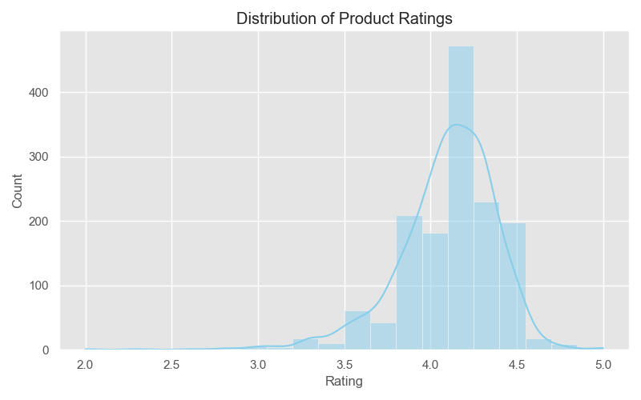

# 🛒 Amazon Sales Analysis

A complete data analysis project to explore product trends, customer behavior, pricing strategies, and rating insights based on Amazon sales data.

## 🔧 Tools Used
- Python (Pandas, NumPy, Matplotlib, Seaborn)
- SQL (MySQL)
- Power BI
- Jupyter Notebooks

## 📁 Folder Structure
- `data/` – Raw and cleaned datasets
- `notebooks/` – Jupyter notebooks for data cleaning, inspection, EDA
- `plots/` – All saved graphs and charts
- `sql/` – SQL queries used for analysis
- `reports/` – Summary reports (PDFs, images, docs)

## 📊 Key Insights
- Found common price points and discount strategies
- Discovered categories with highest average ratings
- Identified top-reviewed and top-rated products
- Built insightful visualizations for business decisions

## 📸 Sample Visualizations

## 🚀 What’s Next
- Create Power BI dashboard
- Build a web dashboard using Flask
- Add trend analysis (time-based)

---

**Created by:** Vamsi Krishna Dasari  
📧 dasarivamsikrishna07@gmail.com  
🔗 [GitHub Profile](https://github.com/dasarivamsikrishna07)
